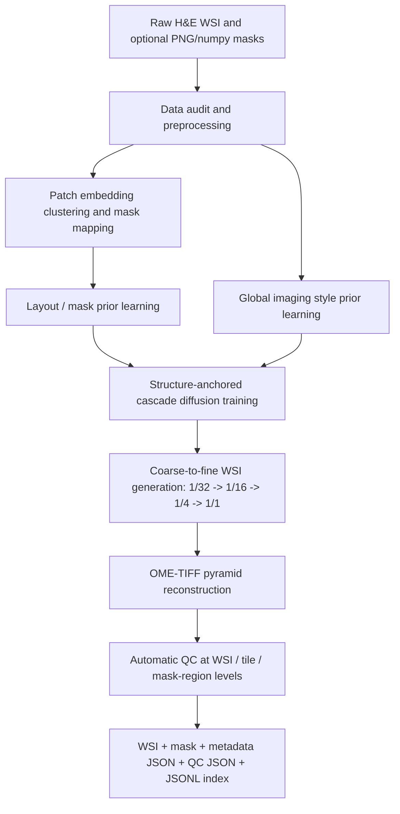

# H&E WSI 数据生成器：结构锚定的多分辨率扩散生成系统

日期：2026-05-18
文档状态：完整研究设计草案 / proposal draft
版本：v0.4.0
适用课题：H&E 染色 Whole Slide Image（WSI）的本地化数据生成器设计
核心目标：设计一个可训练、可配置、可追溯、可自动质控的 H&E WSI 数据生成器，能够从真实 WSI 学习组织布局、语义 mask、成像风格和多倍率细节分布，并生成新的 OME-TIFF pyramid WSI、疾病无关区域 mask、metadata 与自动 QC JSON。

---

## 0. 已确认设计共识与边界

本设计是在前一版“多中心中心域增强”草案基础上的重新定位。旧草案主要关注标签保持的中心风格变换以及下游跨中心泛化；当前版本把课题收束为一个完整的 H&E WSI 数据生成器系统。它不再把下游训练或测试作为当前项目的成败标准，而是把生成系统本身的结构完整性、可控性、可追溯性和自动质量控制作为核心评价对象。

当前已经确认的设计边界如下。这个边界很重要，因为它决定了哪些内容是当前系统必须完成的，哪些内容只能作为后续扩展。如果不先明确边界，课题容易同时承诺 WSI 生成、下游模型训练、专家验证、IHC 扩展和临床分子条件生成，最终反而削弱 proposal 的可信度。

| 类别 | 已确认设计 |
|---|---|
| 研究对象 | H&E WSI 数据生成器 |
| 输出对象 | OME-TIFF pyramid WSI、疾病无关 6 类区域 mask、per-WSI JSON metadata、QC JSON、batch JSONL index |
| 主模型路线 | 结构锚定的多分辨率 mask-conditioned latent diffusion / diffusion transformer |
| 生成顺序 | 从低倍到高倍级联生成：1/32 -> 1/16 -> 1/4 -> 1/1 |
| 最高主动生成层 | 40x，对应 1/1 层 |
| 40x tile 尺寸 | 512 x 512 |
| 结构控制变量 | `structure_anchor`，连续变量，控制是否继承源 WSI 的组织结构与像素内容 |
| 成像风格控制 | 删除用户可见 `domain_shift`，内部使用 `global_imaging_style_prior` |
| 默认 mask 类别 | `background`、`tissue`、`target_pathology`、`supporting_tissue`、`necrosis_debris`、`artifact` |
| LLM 角色 | 知识约束与交互编排，不作为像素级真实性依据，不做文本 embedding 入模 |
| 用户界面 | 本地桌面工具，单页控制台，暴露完整高级参数 |
| 自动 QC | 当前核心验证方式，三层粒度、三级状态、训练分布自适应阈值 |
| 不进入当前成败标准 | 下游训练验证、真人专家盲评、IHC、免疫荧光、临床/分子标签条件 |

需要特别说明的是，本系统所谓 de novo 生成不是无约束随机造图。更准确的定义是：生成器从真实 WSI 中学习低倍组织轮廓、区域语义分布、纹理细节、成像风格和多倍率一致性规律，然后生成不直接复制训练 WSI 的新 WSI 数据对象。换言之，它是 distribution-constrained de novo WSI synthesis，而不是纯噪声驱动的任意图像幻想。

本版本还需要明确一个容易被误解的点：本系统不是为了证明“生成数据一定能提升某个分割模型”，而是为了先建立一套能够可靠产生 WSI 数据对象的生成机制。因此，proposal 的因果链不是“生成更多图像 -> 训练分割模型 -> 指标提高”，而是“真实 WSI 分布被建模 -> 结构和风格条件被显式表达 -> 级联生成输出完整 WSI -> 自动 QC 判断可用性 -> metadata 使样本可追溯”。只有这条链稳定成立，后续下游模型训练才有可靠输入。

### 0.1 细节共识总表

下表把多轮讨论中已经达成的细节共识集中列出。它的作用是防止后续实现或论文撰写时把某些关键边界重新打开，尤其是 `domain_shift`、下游验证、专家评估和 patch 近邻检索这些已经明确不作为当前核心的内容。

| 主题 | 共识 | 因果含义 |
|---|---|---|
| 系统目标 | 生成 H&E WSI 数据对象，而不是先证明下游模型提升 | 成败标准集中在生成链路、输出完整性和自动 QC |
| 生成模型 | 主体为多分辨率 mask-conditioned latent diffusion / DiT | 需要支持空间条件、多倍率条件和结构锚定，不适合只用 GAN/CycleGAN |
| 生成方式 | 从低倍到高倍级联生成 | 低倍决定全局组织结构，高倍逐步丰富细节，避免局部合理但全局失真 |
| 最高倍率 | 40x 主动生成，40x tile 为 512 x 512 | 高倍细胞和纹理细节进入核心系统，而不是仅做 20x 原型 |
| Pyramid 层级 | 1/32、1/16、1/4、1/1 四层 | 生成和 QC 都围绕这四个关键尺度组织 |
| `structure_anchor` | 连续变量，0 为 fully de novo，1 为源 WSI 重扫描模拟 | 控制源 WSI 组织结构和高倍像素内容的继承程度 |
| `domain_shift` | 删除用户可见变量 | 避免多中心输入下“相对哪个中心偏移”的参考系混乱 |
| 风格建模 | 使用内部 `global_imaging_style_prior` | 风格从训练 WSI 分布中采样，不压成单一平均值 |
| Mask | 疾病无关 6 类 | 系统既能支持癌症，也能支持非癌症或罕见病场景 |
| 无标注输入 | patch embedding 聚类生成伪 mask，用户映射类别 | 不依赖大量人工标注，但保留语义来源和置信度 |
| LLM | 知识约束与交互编排，不入模 | 用于 ontology、提示、解释和报告，不承担像素级病理真实性 |
| UI | 本地桌面单页控制台，暴露完整高级参数 | 面向科研用户，优先可控性和复现性 |
| QC | 自动 QC 为核心 | 当前不依赖真人专家，不以下游训练测试作为质量证明 |
| 非复制检测 | 强制写入 QC 报告，但不做全量 patch 近邻、不自动 fail | 支持 de novo 审计，同时避免高 anchor 样本被误判 |
| 后续扩展 | IHC/IF、临床分子、专家盲评、下游训练验证 | 这些增强价值高，但不进入当前系统完成条件 |

## 1. 研究定位

这个课题不应被设计成常规 H&E 图像增强工具。常规增强通常围绕颜色扰动、旋转、裁剪、模糊或 stain augmentation 展开，其主要目的是增加已有图像的训练变化。如果本课题只停留在这个层面，即使生成图像数量很多，也很难说明它解决了 WSI 层级数据生成的问题。

这个课题也不应被设计成完全无约束的“AI 病理图像绘制器”。H&E WSI 不是普通自然图像，它包含低倍组织轮廓、中倍组织区域关系、高倍细胞核和间质纹理，以及多倍率 pyramid 之间的严格对应关系。如果生成器只追求视觉上像 H&E，而没有 mask、metadata、QC 和可追溯机制，它输出的图像很难被当作可靠数据对象使用。

更合适的定位是：构建一个结构锚定、分布约束、多分辨率、可自动质控的 H&E WSI 数据生成系统。它既可以在 `structure_anchor=1` 时模拟同一源 WSI 在不同扫描或染色成像条件下的结果，也可以在 `structure_anchor=0` 时从学习到的 layout/mask prior 和 global imaging style prior 中生成新的 WSI。这样的定位能够同时保留源切片重扫描模拟和 fully de novo 生成两个端点，而不需要设计多套彼此割裂的生成器。

本研究的价值不在于单张合成图像是否足够漂亮，而在于生成系统是否能把 WSI 作为完整数据对象输出。一个可用的生成样本至少应包含图像、mask、生成参数、模型版本、随机种子、源关系、QC 状态和输出路径。只有这些信息同时存在，生成 WSI 才能被复现、审计、筛选和后续使用。

因此，当前课题的主张应保持克制。它可以主张设计一个完整的 H&E WSI 数据生成器，可以主张系统支持从源结构继承到 de novo 生成的连续控制，可以主张自动 QC 能把不可用样本筛出或标记。但它不应在当前版本中宣称生成数据已经替代真实多中心临床数据，也不应把下游模型提升作为当前系统完成的必要证据。

## 2. 核心目标、设计问题与系统主张

### 2.1 主目标

本课题的主目标是设计一个 H&E WSI 数据生成器，使其能够基于约 50 张或类似规模的真实 WSI，学习组织布局、疾病无关区域语义、成像风格和多倍率纹理分布，并生成可复现、可质控、可追踪的 OME-TIFF pyramid WSI。这个目标之所以是核心，是因为它直接回应了用户的实际需求：当前并不是要先训练某个下游分割模型，而是要获得一个能够生成 WSI 数据对象的完整系统方案。

要回答这个主目标，仅有一个生成模型是不够的。生成模型可以产生像素，但不能自动保证输出是可用 WSI。真正需要设计的是一条完整链路：数据导入、mask/伪 mask 生成、模型训练、级联生成、OME-TIFF 重建、metadata 记录、自动 QC 和本地软件交互。任何一个环节缺失，系统都会从“数据生成器”退化为“图像生成脚本”。

### 2.2 核心设计问题

下表列出当前 proposal 中需要解决的核心问题。它们不是彼此独立的任务，而是构成了生成器是否可信的证据链。

| 编号 | 设计问题 | 证据或实现路线 | 最低支持标准 | 失败或降级解释 |
|---|---|---|---|---|
| DQ1 | 如何从真实 WSI 学习可生成的组织结构分布 | 低倍 thumbnail、组织轮廓、6 类 mask、patch embedding 聚类 | 能形成 layout/mask prior，并支持新 layout 采样 | 若只能复制源布局，则系统更像结构增强器 |
| DQ2 | 如何生成多倍率一致的 WSI | 1/32 -> 1/16 -> 1/4 -> 1/1 级联生成 | 高低倍率在组织位置、mask 和纹理趋势上对应 | 若各倍率不一致，OME-TIFF 只能用于展示，不能作为可信 WSI |
| DQ3 | 如何在同一框架中支持源结构继承和 de novo 生成 | `structure_anchor` 控制源条件强度 | 0 到 1 的连续控制具有明确语义和 metadata 记录 | 若需要多套模型切换，系统复杂度和可复现性下降 |
| DQ4 | 如何处理多中心、多组织、多疾病成像风格 | `global_imaging_style_prior` 而非用户可见 `domain_shift` | 生成风格来自训练 WSI 的整体分布，并记录 style seed | 若使用单一平均风格，会抹平真实多样性 |
| DQ5 | 如何在没有大量人工标注时获得 mask 条件 | PNG/numpy 标注导入、ROI、patch 聚类伪 mask、用户映射 | 所有输出 mask 都能追溯类别来源和置信度 | 若 mask 来源不明，后续分割标签和语义控制都不可信 |
| DQ6 | 如何自动判断生成 WSI 是否可用 | WSI/tile/mask 区域三级 QC，pass/warning/fail | 硬错误和严重质量异常能被自动 fail，其他问题可记录 | 若只有视觉预览，系统缺乏规模化筛选能力 |
| DQ7 | 如何证明生成样本不是不透明复制 | 轻量非复制报告：thumbnail、轮廓、mask 布局、全局 embedding | 相似性被记录进 JSON，用于审计和解释 | 若没有相似性记录，de novo 主张会变弱 |

### 2.3 当前不作为主目标的内容

本课题当前不把下游模型训练和测试作为成败标准。下游分割、分类、跨中心泛化和鲁棒性评估可以作为未来扩展，但不应在当前 proposal 中承担主证据角色。这样处理的原因是，当前系统首先要解决的是“能否生成结构完整、可追踪、可质控的 WSI 数据对象”；只有当生成器本身稳定后，下游任务才有明确解释空间。

本课题当前也不把真人专家盲评作为最低依赖。专家评估当然重要，但用户已经明确当前质量验证只考虑自动 QC。因此文档中应把专家盲评列为后续可选增强，而不是最低系统完成条件。LLM 同样不能替代病理专家，它可以整理 ontology、解释用户输入、生成配置和报告失败原因，但不能作为医学真实性裁决者。

### 2.4 因果假设与反事实边界

本课题的核心因果假设是：如果真实 WSI 的低倍结构、区域语义、成像风格和高倍纹理分布能够被分层建模，并且生成过程能够在这些层之间保持一致，那么输出就更可能成为可用的 WSI 数据对象。这里的“更可能”不是经验口号，而是由 WSI 数据的层级结构决定的。低倍组织轮廓决定整张切片是否像真实组织块，中倍区域关系决定不同语义区域是否合理邻接，高倍纹理决定局部病理外观是否可信，metadata 和 QC 决定输出是否能被审计。

反过来，如果系统只生成高倍 patch，再把 patch 拼成 WSI，那么它可能在局部纹理上很好，但低倍形状、区域比例和整体风格很容易失真。如果系统只生成低倍 layout，而高倍细节由简单纹理填充，那么它可能有合理轮廓，却无法支撑 40x 级别的病理图像需求。如果系统没有 mask 和 metadata，那么即使图像看起来真实，也无法判断它表达了什么组织区域、是否来自某个源 WSI、是否可复现。

因此，本设计必须把“像图像”与“像数据对象”分开。前者主要由视觉质量决定，后者还需要语义、坐标、格式、来源、版本和 QC。当前 proposal 要支持的是后者。

### 2.5 设计选择与被放弃路线

为了让方案更完整，必须说明为什么一些看起来更简单或更流行的路线没有被选为主线。

| 路线 | 为什么有吸引力 | 为什么不作为主线 | 可保留位置 |
|---|---|---|---|
| 传统 stain augmentation | 简单、可解释、计算成本低 | 只能改变颜色或有限成像因素，不能生成新 WSI layout/mask | 可作为后续对照或低级风格扰动模块 |
| CycleGAN / StainGAN | 适合无配对风格迁移 | 更偏图像到图像转换，难以承担 de novo WSI、mask 和多倍率一致性 | 可作为重扫描模拟或风格迁移 baseline |
| GAN 生成 | 推理快，历史成熟 | 模式覆盖、条件控制和多倍率一致性压力较大 | 可作为局部 patch 生成对照 |
| 纯随机噪声生成 WSI | 概念上最“全新” | 病理结构容易无约束失真，QC 压力极大 | 不作为当前系统路线 |
| 先高倍 tile 后拼接 | 实现直观 | 全局组织结构、pyramid 一致性和 seam 风险高 | 可作为失败模式对照 |
| 文本 prompt 直接入模 | 交互性强 | 医学图像真实性不能主要依赖文本知识，且当前不设计 text embedding | LLM 保留为知识约束与交互编排 |

这些路线不是全部错误，而是不适合作为当前 proposal 的中心。当前主线选择多分辨率条件扩散，是因为它最能同时承载空间条件、级联生成、结构锚定和高分辨率细节生成。

## 3. 总体系统架构

本系统应按“真实 WSI 导入与数据建模、layout/mask prior 学习、成像风格 prior 学习、级联扩散生成、OME-TIFF 重建、自动 QC、metadata 归档”的顺序设计。这个顺序不是工程习惯上的流水线，而是研究主张的证据顺序。只有先明确数据和条件，生成模型的输出才有可解释的来源；只有输出与 QC、metadata 绑定，生成样本才是可审计的数据对象。



| Stage / Module | Purpose | Inputs | Main task | Output | Decision gate |
|---|---|---|---|---|---|
| 数据导入与审计 | 确定哪些 WSI、mask 和元数据可用 | WSI、PNG/numpy mask、ROI、疾病/组织说明 | 文件读取、倍率识别、坐标系统记录、权限边界整理 | 数据 manifest | 文件是否可读、坐标是否一致 |
| 伪 mask 与类别映射 | 在少标注条件下形成统一语义条件 | 真实 mask、ROI、patch embedding、用户映射 | 自动读取编号、聚类伪标签、映射到 6 类 | mask mapping JSON | 类别来源是否可追溯 |
| Layout/mask prior | 学习低倍组织结构与区域分布 | thumbnail、6 类 mask、组织轮廓 | 学习轮廓、区域比例、邻接关系和空间分布 | layout/mask generator | 能否采样合理新布局 |
| Global style prior | 学习多中心成像风格整体分布 | 真实 WSI tile、颜色/清晰度/伪影统计 | 学习颜色、染色、焦平面、污渍、压缩和扫描噪声分布 | style prior、style seed | 风格是否覆盖训练数据变化 |
| 级联生成模型 | 逐层生成 WSI | 上一层结果、mask、坐标、style seed、source 条件、structure_anchor | 训练 mask-conditioned latent diffusion / DiT | 1/32、1/16、1/4、1/1 图像层 | 多倍率是否一致 |
| OME-TIFF 重建 | 输出真实工具可读的 WSI 文件 | 生成图像层、mask、metadata | 构建 OME-TIFF pyramid | OME-TIFF、mask 文件 | 文件是否完整可读 |
| 自动 QC | 判定生成样本质量 | WSI、mask、metadata、训练分布统计 | 三级状态判定、离群检测、相似性报告 | QC JSON | 是否 pass/warning/fail |
| 归档与索引 | 支持复现、审计和批量管理 | 输出路径、模型版本、seed、QC | 写 per-WSI JSON 和 JSONL index | metadata JSON、batch JSONL | 是否能复现生成 |

这个架构的关键点是统一性。四种用户语义模式，例如重扫描模拟、结构保留生成、布局重组生成和 fully de novo 生成，不对应四套模型。它们只是 `structure_anchor` 和 source 条件强度的不同工作点。系统始终走同一条级联生成路线，只是源结构、源像素和生成 prior 的权重不同。

### 3.1 数据流与因果依赖

系统的数据流应被理解为一组因果依赖，而不是简单的文件处理顺序。真实 WSI 首先提供三个不同层面的信息：低倍组织结构、区域语义分布和高倍纹理/成像风格。低倍结构进入 layout/mask prior，区域语义进入 6 类 mask 条件，高倍纹理和扫描外观进入 image generator 与 global style prior。如果这些信息混在一起处理，模型可能把疾病组织结构、中心风格和局部伪影学成同一个不可解释 latent。

因此，本系统应把数据拆成以下几类中间对象：

| 中间对象 | 来源 | 后续作用 | 如果缺失会怎样 |
|---|---|---|---|
| WSI thumbnail / tissue contour | 原始 WSI 低倍层 | 学习组织轮廓、碎片数、组织面积和低倍布局 | de novo 生成缺少全局组织形状依据 |
| 6 类 mask | 输入标注、ROI、聚类伪标签和用户映射 | 作为所有倍率的语义条件 | 生成图像无法和区域语义稳定对应 |
| Patch embedding | 真实 WSI tile | 聚类、伪 mask、全局相似性报告 | 无标注时难以建立语义候选区域 |
| Style statistics / style latent | 真实 WSI tile 和 slide-level 统计 | global imaging style prior | 生成风格会退化为固定或随机扰动 |
| Source relation | 用户选择的源 WSI 和 `structure_anchor` | 控制源结构或像素继承 | 高 anchor 模式无法复现和解释 |
| QC reference distribution | 真实训练 WSI 和生成中间结果 | 自适应阈值和 warning/fail 判定 | QC 阈值只能手工设定，跨数据集不稳 |

这个分解也解释了为什么系统需要 metadata。metadata 不是事后说明，而是把上述因果依赖写入可审计文件。没有 metadata，生成样本和训练数据、模型版本、随机种子、mask 映射、QC 阈值之间的关系会断裂。

### 3.2 生成模式的统一实现逻辑

四种用户模式可以由同一套级联扩散系统实现。其核心不是切换模型，而是改变源条件进入每个阶段的强度。

| 模式 | Layout/mask 来源 | 高倍像素来源 | 风格来源 | 主要风险 |
|---|---|---|---|---|
| 重扫描模拟 | 源 WSI 结构和源 mask | 源 WSI 高倍像素为内容基底 | global style prior 采样并轻微扰动 | 被误当成 fully de novo 样本 |
| 结构保留生成 | 源结构为主，允许局部扰动 | 源像素和生成模型混合 | global style prior | 局部重绘改变病理细节 |
| 布局重组生成 | 源结构与 layout prior 混合 | 生成模型为主，源条件较弱 | global style prior | 组织布局出现不自然拼接 |
| Fully de novo | layout/mask prior | 生成模型 | global style prior | 结构过近似训练 WSI 或 QC warning 高 |

这种统一逻辑有两个好处。第一，它降低工程复杂度，避免每个模式都训练一个模型。第二，它让 `structure_anchor` 成为可记录、可复现、可实验控制的变量，而不是模糊的 UI 按钮。

## 4. 数据导入、预处理与语义 mask 体系

### 4.1 目的

数据导入阶段的目标不是尽快把 WSI 切成 tile，而是建立后续生成可依赖的数据坐标系统。WSI 生成器必须知道每张输入切片的倍率、MPP、pyramid 层级、组织区域、可选 mask 坐标和输出对齐方式。如果这一步不严谨，后续生成的 OME-TIFF 和 mask 即使视觉上合理，也可能在坐标上不可用。

系统第一版默认支持常见 WSI 输入格式，例如 SVS、NDPI、MRXS 和 OME-TIFF。输出格式锁定为 OME-TIFF pyramid，这是因为 OME-TIFF 更开放、标准化程度更高，也更适合作为生成 WSI 的交付格式。若输入格式包含不完整元数据，系统应在 manifest 中显式记录缺失项，而不是静默假设。

### 4.2 疾病无关 6 类 mask

当前系统不应使用癌症专属类别作为默认语义体系。用户目前手头数据以泛癌 H&E 为主，但系统目标并不是癌症专用生成器。更合理的默认体系是疾病无关 6 类：

| 类别 | 含义 | 在癌症场景中的常见对应 | 在非癌症或罕见病场景中的解释 |
|---|---|---|---|
| `background` | 非组织区域、玻片空白 | 背景 | 背景 |
| `tissue` | 有组织但暂不可靠细分的区域 | 未细分组织 | 未细分组织 |
| `target_pathology` | 用户希望生成或控制的主要病变区域 | 肿瘤区域 | 目标异常、病灶或疾病相关结构 |
| `supporting_tissue` | 支撑性组织或病变周围组织 | 间质、纤维组织、微环境 | 周围组织、反应性组织或背景组织 |
| `necrosis_debris` | 坏死、碎屑、坏死样或退变区域 | 肿瘤坏死 | 坏死、炎性碎屑、退变物 |
| `artifact` | 技术伪影和非生物学异常 | 折叠、污渍、离焦、气泡 | 同左 |

这个类别体系的设计原则是稳健而不是细致。它不能替代器官特异的病理 ontology，也不试图表达所有细胞级结构。它的作用是为 WSI 生成提供一个通用的、可跨疾病使用的区域级条件。对于需要更细类别的任务，用户可以在后续扩展中增加自定义类别，但当前核心系统应保持 6 类输出。

### 4.3 输入 mask 与伪 mask

系统应同时支持三类语义来源。第一类是用户提供的 PNG 或 numpy mask。系统读取文件后，应自动识别其中出现的数字编号，并弹窗要求用户把每个编号映射到 6 类之一，同时填写语义说明和可选置信度。第二类是少量 ROI 标注。系统可以把 ROI 作为局部高置信语义区域，并在未标注区域使用聚类伪标签补全。第三类是完全无标注 WSI。在这种情况下，系统应使用 patch embedding 聚类生成候选伪 mask，再由用户确认或修正类别映射。

伪 mask 的边界必须写清楚。它不是专家金标准标注，也不应被描述为自动诊断结果。它是生成控制条件，用于告诉模型哪些区域应产生不同类型的组织外观。metadata 必须记录每个 mask 区域的来源，例如人工导入、ROI 推断、聚类伪标签或用户修正。这样后续用户才能知道哪些区域是高置信条件，哪些区域只是生成 prior 的辅助约束。

更具体地说，mask 生成和映射应按如下顺序执行：

1. 先读取输入 WSI 的低倍组织区域，生成 tissue/background 初始 mask。
2. 如果用户提供 PNG/numpy mask，则识别所有唯一数字编号，并检查其尺寸、坐标系和 WSI pyramid 是否可对齐。
3. 如果用户提供 ROI，则将 ROI 投影到 WSI 坐标，并把 ROI 覆盖区域标记为高置信语义候选。
4. 对未标注组织区域提取 patch embedding，按局部形态和纹理聚类，形成候选伪语义区域。
5. 弹窗或映射表要求用户把输入编号和聚类编号映射到 6 类，并记录说明、来源和置信度。
6. 将人工 mask、ROI 和聚类伪 mask 合并为统一 6 类 mask；若冲突，人工输入优先于 ROI，ROI 优先于聚类。
7. 将每个区域的来源写入 metadata，使后续生成和 QC 能区分高置信区域和伪标签区域。

这个顺序的原因是，生成器需要统一的 mask 条件，但不同来源的可信度不同。如果把聚类伪标签和用户标注混为同一来源，后续质量问题就无法追溯。如果完全拒绝伪标签，又会违背“不依赖大量人工标注”的目标。

### 4.5 标注来源的可信度分层

为了让 mask 输出更可解释，系统应为每个 mask 区域记录来源等级。这个等级不需要复杂统计模型，但必须能被 JSON 表达。

| 来源等级 | 来源 | 默认可信度 | 用途 |
|---|---|---:|---|
| A | 用户提供并确认的 PNG/numpy 区域 | 高 | 训练条件、生成条件、QC 对齐参考 |
| B | 用户提供 ROI 投影区域 | 中高 | 局部语义控制和高置信示例 |
| C | patch embedding 聚类后由用户映射 | 中 | 伪 mask 生成条件 |
| D | 完全自动聚类且未被用户确认 | 低 | 仅作为弱结构 prior，不应作为强标签解释 |

这个分层不是为了复杂化系统，而是为了避免“自动生成 mask 等同于专家标签”的误解。系统可以输出 mask，但必须说明 mask 是如何来的。

### 4.4 成功标准与风险信号

数据导入模块的成功标准是每张输入 WSI 都能生成清晰的数据记录，包括文件路径、格式、倍率、pyramid 层级、组织区域、mask 来源、类别映射和坐标变换。最低可接受结果是系统能处理常见 WSI 格式并输出与 WSI 对齐的 6 类 mask。失败信号包括：mask 坐标和 WSI 坐标无法对应，输入编号无法解释，MPP 缺失且无法可靠推断，或同一 WSI 的不同层级出现不可解释的尺度偏移。

如果这些问题不能解决，后续生成不应继续。因为 WSI 生成系统的可信度首先来自坐标和语义条件的可追溯，而不是来自扩散模型本身。

## 5. Layout / Mask Prior 与 Global Imaging Style Prior

### 5.1 Layout / Mask Prior

Layout/mask prior 的目标是学习真实 WSI 的低倍结构规律。它应覆盖组织轮廓、组织占比、碎片数量、区域比例、区域邻接关系和低倍空间分布。对于 `structure_anchor=0` 的 fully de novo 生成，layout/mask prior 是新 WSI 结构的主要来源；对于中间 anchor 值，它负责与源 WSI 结构混合或扰动；对于 `structure_anchor=1`，它主要用于检查源结构是否合理，而不是替代源结构。

这个模块可以用多种模型实现，例如低倍 mask diffusion、VQ-VAE + transformer、latent diffusion 或其他离散/连续布局生成器。当前 proposal 不应过早锁死具体 backbone，因为真正重要的是模块职责：生成或继承低倍组织结构，并输出与后续各倍率一致的 6 类 mask。

### 5.2 Global Imaging Style Prior

用户已经决定删除 `domain_shift` 作为用户可见变量。这是合理的，因为源 WSI 本身可能来自多中心、多组织、多疾病，若要求用户指定“相对哪个 domain shift”，参考系会变得含糊。替代方案是内部学习一个 `global_imaging_style_prior`，从全部训练 WSI 中建模颜色、染色强弱、焦平面、污渍、压缩、扫描噪声和纹理外观的分布。

这里要避免一个误解：global style prior 不是单一平均风格。单一平均风格会把多中心风格差异抹平，生成结果可能变得过于标准化。更合适的是学习一个风格分布，生成时采样 slide-level style seed，并允许局部轻微扰动。这样同一批生成 WSI 可以有真实感的成像差异，而不需要用户理解和调节复杂的风格滑杆。

在 `structure_anchor=1` 时，系统应以源 WSI 的高倍像素和组织结构为内容基底，但从 global imaging style prior 采样新的成像风格并进行轻微扰动。这对应同一切片在不同扫描仪、染色状态或成像流程下的模拟结果。如果同一个源 WSI 需要生成多个输出，style seed 和局部扰动可以让它们不完全相同。

### 5.3 输入、输出与风险

| 模块 | 输入 | 输出 | 成功标准 | 风险信号 |
|---|---|---|---|---|
| Layout/mask prior | thumbnail、6 类 mask、组织轮廓、坐标 | 新 layout、新 mask、结构扰动参数 | 新布局在组织面积、碎片数量和区域邻接上处于训练分布内 | 生成布局过于规则、碎片异常或区域比例极端 |
| Global style prior | 真实 WSI tile、颜色统计、清晰度、伪影统计 | style latent、style seed、局部扰动范围 | 生成风格覆盖训练 WSI 的自然变化 | 风格塌缩为单一平均，或生成过强离群风格 |
| Source anchor | 源 WSI、源 mask、源 tile、anchor 值 | 源结构或像素条件 | anchor 语义清晰且可复现 | anchor=1 被误用为复制训练数据而不记录来源 |

如果 style prior 学到的是组织类型差异而非成像差异，生成器可能把疾病或器官差异误当成扫描风格。为降低这个风险，训练和 QC 中应按组织区域、疾病类型或 mask 类别分层统计风格特征。若无法完全区分，也应在 metadata 中记录风格采样来源和不确定性。

### 5.4 为什么不是单一全局平均风格

用户曾提出删除 `domain_shift` 后直接使用全局平均值。这个方向是对的，但需要进一步区分“平均值”和“分布”。如果把所有训练 WSI 的颜色、清晰度、污渍和扫描噪声压成单一平均风格，生成样本会变得过于标准化，反而丢失多中心数据中真实存在的成像多样性。这样的系统可能更稳定，但不像真实 WSI 生成器，更像统一染色风格模拟器。

因此，当前设计采用 global imaging style prior。它不是让用户调一个风格滑杆，而是让系统在内部学习一个分布。生成时，每张 WSI 采样一个 slide-level style seed；同一张 WSI 内的 tile 共享这个 style seed，并允许受控局部扰动。这样既避免 `domain_shift` 的参考系问题，又保留多中心多扫描仪数据带来的自然变化。

这个选择的因果意义是：风格多样性来自训练 WSI 的经验分布，而不是来自用户主观调参。用户不需要决定“偏向哪个中心”，但系统仍能生成不同染色、焦平面、污渍和压缩状态下的 WSI。

### 5.5 Conditional Priors 的产物与约束机制

`conditional priors learning` 不是在学习一个抽象的“先验感觉”，而是在把真实 WSI 中可重复、可采样、可追溯的结构因素拆成一组条件变量。对当前系统而言，这组条件至少包括：`L`（layout）、`M`（6 类 mask）、`S`（global imaging style）、`T`（texture / morphology latent）、`A`（artifact / focus 变化）、`y`（癌种或组织类型标签）、`coord`（WSI 坐标）、`x_src`（源 WSI 条件）和 `alpha`（`structure_anchor`）。

若训练数据记为 `D`，系统可以写成层级联合分布：

```text
p(X, M, L, S, T, A | y)
= p(L | y) p(M | L, y) p(S | y) p(T | M, y) p(A | S) p(X | L, M, S, T, A, y)
```

这里的 `p(L | y)`、`p(M | L, y)`、`p(S | y)`、`p(T | M, y)` 和 `p(A | S)` 不是最终图像生成器本身，而是生成模型的条件来源。它们的职责是先定义“哪些布局、哪些 mask、哪些风格、哪些纹理、哪些伪影组合是合理的”，再把这些条件交给扩散模型去实现像素级生成。

| prior 类型 | 学到的结果 | 进入生成器的方式 | 约束含义 |
|---|---|---|---|
| Layout / mask prior | 低倍组织轮廓、组织碎片数量、区域比例、邻接关系、6 类 mask 分布 | 作为当前尺度 mask、低倍条件图或空间引导输入 | 限制组织形状和区域拓扑，不让生成器随意编造全局布局 |
| Global imaging style prior | stain 强度、颜色分布、焦平面、污渍、压缩、扫描噪声的分布 | 作为 slide-level style seed、style latent 或 FiLM / AdaIN 条件 | 限制成像外观，让同一 WSI 内风格一致且多中心风格可采样 |
| Texture / morphology prior | patch 聚类、局部纹理 codebook、区域特异形态 latent | 作为局部 token、cluster embedding 或 class-conditioned latent | 限制高倍细节在语义上与 mask 区域匹配 |
| Multi-resolution prior | 不同倍率之间的结构对应关系 | 作为上一倍率图像 / latent 的条件输入 | 限制 1/32、1/16、1/4、1/1 之间的一致性 |
| Source-anchor prior | 源 WSI 的结构与像素继承关系 | 作为 `x_src` 条件和 `alpha` 权重 | 限制高 anchor 模式下的重扫描模拟和结构保留生成 |
| QC reference prior | 真实训练分布中的正常范围、分位数和阈值 | 作为生成后判定标准，不直接改写像素 | 限制输出落在可接受质量边界内 |

在实际模型里，这些 prior 不要求是彼此独立的黑盒模块。它们可以是分布拟合器、编码器、离散 codebook、统计阈值集，也可以是一个统一系统里的不同头部。关键不在于形式是否统一，而在于它们都能输出明确的条件对象。

这些条件对象再通过五种方式约束生成模型：

1. 作为条件输入：`M`、`S`、`T`、`coord`、`x_src` 和 `alpha` 进入 U-Net、DiT 或条件分支。
2. 作为采样边界：layout 和 style 不从任意噪声中取值，而从学到的分布中采样。
3. 作为训练目标：扩散损失之外，再加 mask 一致性、跨倍率一致性、style 一致性和 source 保留损失。
4. 作为推理 guidance：用条件 dropout、CFG 或权重调节控制 priors 的影响强弱。
5. 作为 QC 规则：生成后用 reference prior 的统计范围判断 `pass`、`warning` 或 `fail`。

一个可执行的扩散目标可以写成：

```text
L_diff = E[ || epsilon - epsilon_theta(X_t, t, C) ||^2 ]
```

其中 `C = {L, M, S, T, A, y, coord, x_src, alpha}`。这说明生成模型真正学习的是条件分布：

```text
p_theta(X | C)
```

而不是无条件的 `p_theta(X)`。换句话说，conditional priors 不是拿来“描述风格”的，而是拿来把原本无限大的像素空间收缩成一个受条件约束的可生成空间。

`structure_anchor` 也可以在这个框架里理解。`alpha=1` 时，`x_src` 的权重最高，系统更接近重扫描模拟或结构保留生成；`alpha=0` 时，源条件被压低或 dropout，layout/mask prior 和 style prior 成为主导，系统更接近 fully de novo 生成。中间值不是简单插值像素，而是对条件强度和 loss 权重的连续调节。

因此，conditional priors learning 的最终产物不是单一 latent，而是一套“条件对象 + 分布参数 + 置信度/阈值”的组合。它们共同决定：模型可以生成什么、应该怎样生成、哪些结果可以保留、哪些结果必须被 QC 拦下。

## 6. 结构锚定变量 `structure_anchor`

### 6.1 定义

`structure_anchor` 是当前系统唯一核心用户控制变量。它是 0 到 1 的连续变量，用于控制生成结果与某个源 WSI 的组织结构和像素内容的关系。它不再和 `domain_shift` 捆绑，也不承担成像风格偏移的含义。

当 `structure_anchor=1` 时，系统进入重扫描模拟语义。生成器完全继承源 WSI 的组织结构和高倍像素内容，只模拟不同扫描、染色、焦平面、压缩、污渍或成像扰动带来的外观变化。这个模式不是 de novo 结构生成，而是同一切片不同成像结果的模拟。它仍然需要记录 source WSI 关系，因为它与源数据强相关。

当 `structure_anchor=0` 时，系统进入 fully de novo 语义。生成器不依赖某一张源 WSI 的结构或像素内容，而是从 layout/mask prior 和 global imaging style prior 中生成新的 WSI、mask 和 metadata。这个模式最能体现数据生成器的创造性，但也最依赖自动 QC 和非复制相似性报告。

中间值表示源结构条件逐渐减弱。系统可以保留部分源轮廓、区域比例或局部结构趋势，同时允许 layout/mask prior 对组织布局进行扰动和重组。这里的中间值不是简单线性插值图像像素，而是对源结构条件、源 mask 条件和生成 prior 条件的权重调节。

### 6.2 四种用户语义预设

虽然底层只有一套统一模型，但用户界面可以提供四种预设，帮助用户理解 `structure_anchor` 的典型工作点。

| 模式 | `structure_anchor` 范围 | 风格来源 | mask 来源 | 语义解释 |
|---|---:|---|---|---|
| 重扫描模拟 | 0.9-1.0 | global style prior 采样后轻微扰动 | 源 mask 继承并做坐标 QC | 同一源 WSI 的不同扫描/染色成像模拟 |
| 结构保留生成 | 0.7-0.9 | global style prior | 源 mask 为主，可局部修正 | 保留源 WSI 大结构，高倍局部由模型重新生成或轻度重绘 |
| 布局重组生成 | 0.3-0.7 | global style prior | 源结构与新 layout/mask prior 混合 | 从源结构和学习分布中生成新布局变体 |
| Fully de novo | 0.0-0.3 | global style prior | 新生成 mask | 不绑定单张源 WSI，生成新的 WSI 数据对象 |

这些预设不应被实现成四个不同生成器。它们只是同一套条件扩散系统中的参数组合。这样做可以降低系统复杂度，也能保持 metadata、QC 和训练协议的一致性。

### 6.3 成功标准与失败信号

`structure_anchor` 成功的标准是语义可解释。用户设置高 anchor 时，输出应明显继承源 WSI 的结构或像素内容；用户设置低 anchor 时，输出应呈现新的 layout 和 mask，而不是暗中复制源 WSI。失败信号包括：anchor 变化对输出没有可见影响；anchor=1 时无法保留源切片内容；anchor=0 时仍与某个源 WSI 高度结构相似且没有记录来源；或者中间值产生不自然的组织断裂。

### 6.4 `structure_anchor` 的训练与推理含义

`structure_anchor` 既是用户控制变量，也是训练时需要被模型理解的条件。它不能只在推理阶段简单调权重，否则模型可能从未见过低 anchor 或中间 anchor 的条件组合，生成结果会不稳定。训练时应构造不同 anchor 强度的样本，使模型学会在源结构、源像素和生成 prior 之间连续过渡。

一个可执行的训练策略是条件 dropout 与源条件扰动结合。训练过程中，系统随机保留、弱化或移除源 layout、源 mask、源 tile 特征和源高倍像素条件，并把对应的 `structure_anchor` 数值输入模型。高 anchor 样本训练模型重绘或重扫描源内容；低 anchor 样本训练模型依赖 layout/mask prior；中间 anchor 样本训练模型学习结构重组与局部生成。

这里要再次强调：`structure_anchor=1` 不是“输出文件没有生成价值”。它的价值是重扫描模拟，即同一组织内容在不同成像风格下的呈现。它应完整记录 source WSI 关系，不能和 fully de novo 样本混淆。`structure_anchor=0` 才承担最强 de novo 生成主张，因此它对非复制报告、layout 合理性和 QC 的依赖更强。

### 6.5 不同 anchor 区间的因果解释

| anchor 区间 | 主要因果来源 | 输出解释 | 需要重点 QC 的内容 |
|---:|---|---|---|
| 0.9-1.0 | 源 WSI 结构和高倍像素 | 同一切片重扫描/重染色模拟 | 文件完整性、风格扰动合理性、source 记录 |
| 0.7-0.9 | 源结构为主，生成模型局部重绘 | 结构保留的生成变体 | 局部纹理是否改变病理含义 |
| 0.3-0.7 | 源结构和生成 prior 混合 | 布局重组或半锚定生成 | 组织边界、mask 连续性、结构断裂 |
| 0.0-0.3 | layout/mask prior 和 style prior | fully de novo WSI | 布局合理性、非复制报告、多样性 |

这张表也可以指导 UI 默认值。用户如果想模拟同一 WSI 的不同扫描结果，应使用高 anchor；如果想生成新 WSI，应使用低 anchor；如果想在源 WSI 基础上生成结构变体，应使用中间 anchor。

## 7. 多分辨率级联生成模型

### 7.1 主模型选择

本系统主模型建议采用多分辨率 mask-conditioned latent diffusion 或 diffusion transformer。GAN、CycleGAN 和传统 stain transfer 可以作为参考或基线，但不适合作为当前主模型。原因是本系统需要同时处理 de novo 结构生成、mask 条件、多倍率 pyramid、一致性、结构锚定和 metadata 追踪，传统 GAN 类方法在全局可控性和多倍率一致性方面压力较大。

当前设计不应锁死某一个具体开源模型名称。更稳妥的写法是锁定模型族和条件结构：以 latent diffusion / DiT 为主体，以 6 类 mask、坐标、上一倍率结果、style seed、`structure_anchor` 和可选 source 条件作为输入。这样即使未来具体 backbone 变化，系统设计仍然成立。

从因果角度看，latent diffusion / DiT 的作用不是简单生成漂亮 tile，而是把多个条件变量整合成像素结果。mask 决定局部语义，坐标决定空间位置，上一层图像决定跨倍率结构，style seed 决定同一 WSI 的成像风格，`structure_anchor` 决定源 WSI 内容继承程度。一个合适的生成模型必须能同时接收这些条件，并在推理时连续调整条件强度。普通无条件生成模型无法承担这一任务。

### 7.1.1 Backbone 选择原则

具体实现时可以在 latent diffusion U-Net 和 diffusion transformer 之间选择。proposal 不需要现在确定唯一 backbone，但需要明确选择原则。

| 候选 | 优点 | 风险 | 适用判断 |
|---|---|---|---|
| Latent diffusion U-Net | 成熟、可控、适合空间条件和多尺度结构 | 对长程依赖和超大 WSI 全局建模有限 | 第一版实现更稳 |
| Diffusion transformer / DiT | 更适合 token 化 latent 和大规模条件建模 | 数据量和算力要求更高，调试成本大 | 数据和算力充足时可作为主实现或升级路线 |
| ControlNet-like 条件注入 | 适合把 mask、边界、低倍图作为条件接入 | 需要设计病理特定条件通道 | 适合作为空间条件机制 |
| 纯文本条件 diffusion | 交互直观 | 当前不设计文本 embedding 入模，医学真实性证据不足 | 不作为当前路线 |

因此，文档层面应写成“mask-conditioned latent diffusion / DiT”，实现层面可以优先从 latent diffusion U-Net 起步，并保留 DiT 作为可替换 backbone。

### 7.2 四层 pyramid 级联

生成顺序锁定为四层级联：1/32 -> 1/16 -> 1/4 -> 1/1。最高主动生成层为 40x，1/1 层 40x tile 尺寸为 512 x 512。低倍层负责全局组织轮廓和区域关系，中倍层负责组织结构和区域边界，高倍层负责细胞核、间质、坏死碎屑、伪影和 H&E 纹理细节。

这个设计比“先生成高倍 tile 再下采样”更适合 WSI。后者容易出现局部 tile 看起来合理，但整张切片低倍结构不自然的问题。级联生成的优势在于每一层都以上一层为条件，能够把全局结构逐步传递到高倍细节。

四个层级的功能不应写成纯分辨率描述，而应写成责任分工：

| 层级 | 责任 | 主要输出 | 失败时的表现 |
|---|---|---|---|
| 1/32 | 决定组织轮廓、组织块数量、粗区域分布 | thumbnail、低倍 mask、组织 contour | 整张 WSI 形状不自然或背景/组织比例异常 |
| 1/16 | 稳定主要区域边界和组织邻接关系 | 中低倍结构图、区域过渡 | tumor/supporting/artifact 等区域混乱或边界断裂 |
| 1/4 | 补充组织结构、纹理走向和局部上下文 | 中倍 tile / latent | 高倍生成缺少上下文，局部结构漂移 |
| 1/1 | 生成 40x 高倍 H&E 细节 | 512 x 512 tile | 核细节、间质纹理、坏死碎屑和伪影不可信 |

这个分工解释了为什么不能只生成 1/1 再下采样。低倍不是高倍的副产品，而是高倍生成的条件来源之一。

### 7.3 每层条件输入

每一层生成模型都应接收完整条件，而不是只看上一层图像。完整条件包括：

| 条件 | 作用 |
|---|---|
| 上一层图像或 latent | 保证 coarse-to-fine 连续性 |
| 当前尺度 6 类 mask | 控制语义区域和图像内容对应 |
| 坐标与倍率编码 | 告诉模型 tile 在 WSI 中的位置和生成层级 |
| `global_imaging_style_prior` 的 style seed | 保持同一 WSI 内成像风格一致 |
| `structure_anchor` | 控制源结构/像素条件强度 |
| 可选 source WSI 条件 | 在高 anchor 模式下继承源结构或像素 |
| 邻域上下文或重叠区域 | 减少 tile seam 和局部断裂 |

完整条件会增加工程复杂度，但它支撑了系统最重要的能力：同一模型连续覆盖重扫描模拟、结构保留、布局重组和 fully de novo。若条件过少，模型可能只能生成看似合理的局部 tile，却无法稳定控制源结构继承或 WSI 层级一致性。

### 7.4 三阶段训练协议

训练协议采用三阶段主线。这里的 mask、style seed、layout 和 `structure_anchor` 不是临时拼接的输入，而是上一节定义的 conditional priors 的实例化结果。第一阶段训练或拟合 layout/mask prior，学习低倍组织轮廓、6 类区域比例、邻接关系和结构采样。第二阶段训练 mask-conditioned 多倍率图像生成器，使模型学会从 mask、坐标、style seed 和上一层结果生成 H&E 图像。第三阶段进行 WSI 一致性微调，重点处理同一 WSI 内的 tile seam、跨倍率对应和 slide-level style 一致性。

这三个阶段不是三个独立产品，而是同一系统的训练顺序。第一阶段提供结构条件，第二阶段提供图像生成能力，第三阶段把局部生成能力提升为 WSI 层级生成能力。如果第三阶段省略，系统仍可能生成单个 tile 或局部区域，但整张 WSI 的连贯性会更依赖推理规则和自动 QC。

更具体地说，三阶段训练应形成如下依赖关系：

| 阶段 | 输入样本 | 学到的内容 | 输出给下一阶段 | 失败后果 |
|---|---|---|---|---|
| Layout/mask prior | thumbnail、contour、6 类 mask、聚类伪 mask | 低倍结构分布、区域比例、邻接关系 | 可采样 layout/mask 条件 | de novo 模式缺少结构基础 |
| 多倍率图像生成 | 各层图像、mask、坐标、style seed、source 条件 | 从条件到 H&E 图像的映射 | 各倍率生成能力 | 只能生成 mask，不能生成可信像素 |
| WSI 一致性微调 | 相邻 tile、同一 WSI 多层图像、overlap 区域 | seam、跨倍率和同 WSI 风格一致性 | 可重建 pyramid 的生成模型 | 输出像 patch 集合，不像 WSI |

训练样本不应只从随机 tile 抽取。对于第二、三阶段，采样策略应覆盖不同 mask 类别、不同组织区域、不同 WSI、不同 style seed 和不同 `structure_anchor` 区间。否则模型可能在常见组织上表现很好，但在 `necrosis_debris`、`artifact` 或低 anchor de novo 模式下失稳。

### 7.4.1 训练样本构造

训练样本应围绕 WSI 坐标和 pyramid 层级构造。每个样本至少需要包含：某个位置的 1/32、1/16、1/4、1/1 图像或 latent；对应尺度的 6 类 mask；tile 坐标；slide-level style seed 或 style statistics；source WSI 条件；以及 `structure_anchor`。如果是高 anchor 训练样本，源 WSI 条件应保留更多；如果是低 anchor 样本，应弱化或移除源条件，让模型依赖 layout/mask prior。

这种训练样本设计的目的，是让模型在训练阶段就见到不同程度的源条件，而不是只在推理时临时调参。否则 `structure_anchor` 会变成 UI 幻觉：界面上有滑杆，模型却没有学过如何响应它。

### 7.5 训练约束

当前 proposal 不应把损失函数写死成具体公式和权重，因为实现时可能根据 backbone、数据量和算力调整。但必须明确五类必备训练目标：

| 训练约束 | 目的 | 失败信号 |
|---|---|---|
| 扩散生成目标 | 学习 H&E 图像分布和去噪生成能力 | 图像模糊、纹理不稳定、细节塌缩 |
| 语义 mask 一致性 | 保证生成内容符合 6 类 mask 条件 | mask 区域与图像语义不匹配 |
| 跨倍率一致性 | 保证 1/32、1/16、1/4、1/1 在结构上对应 | 高低倍组织位置不一致 |
| Tile seam 一致性 | 减少相邻 tile 边界处颜色、纹理和结构断裂 | 拼接边缘出现明显断层 |
| 同 WSI 风格一致性 | 保证同一 WSI 内成像风格整体统一 | 不同 tile 像来自不同扫描仪或染色批次 |

Tile seam 一致性可以通过 overlap 区域比较、边界 latent 对齐或邻域条件实现。同 WSI 风格一致性可以通过 slide-level style seed、style encoder embedding 或颜色/清晰度统计约束实现。它们不要求整张 WSI 每个区域完全同质，因为真实切片也存在组织厚薄、局部污渍和焦平面变化；它们要求的是整体扫描和染色风格不发生无解释跳变。

### 7.6 训练约束与自动 QC 的对应关系

训练目标和 QC 不应各自独立。训练约束负责让模型尽量生成好样本，QC 负责在生成后检测是否真的达到要求。二者应在设计上互相映射。

| 训练约束 | 对应 QC | 如果 QC 经常失败，说明什么 |
|---|---|---|
| 语义 mask 一致性 | mask 区域合理性、mask 与图像语义检查 | mask 条件没有被模型有效使用，或伪 mask 质量不足 |
| 跨倍率一致性 | pyramid 一致性 | 级联条件传递不足，低倍和高倍解耦 |
| Tile seam 一致性 | seam score、overlap 区域差异 | 邻域条件不足或 tile 采样策略不合理 |
| 同 WSI 风格一致性 | 同 WSI 风格一致性 QC | style seed 没有成为 slide-level 条件，或局部扰动过强 |
| 扩散生成目标 | 颜色、清晰度、组织纹理质量 QC | 图像分布学习不足或采样参数不稳定 |

这种映射很重要，因为它让 QC 不只是“最后打分”，而是成为训练失败诊断工具。当前系统不做自动闭环重训，但 QC JSON 可以用于离线分析和下一轮配置调整。

## 8. 本地桌面工具与用户交互

### 8.1 交互定位

系统第一版采用本地桌面工具，而不是 Web 上传式界面。WSI 文件体积大，路径和权限复杂，本地工具更适合读取原始 WSI、PNG/numpy 标注、模型 checkpoint 和生成输出目录。用户界面采用单页控制台，而不是项目向导。这样做的原因是目标用户更接近科研开发者或高级病理 AI 用户，他们需要快速访问完整参数，而不是被简化流程限制。

单页控制台不等于没有流程。界面应在一个页面中清晰分区：数据输入、标注映射、模型训练/加载、生成参数、任务状态、QC JSON 输出和导出路径。这样既保留高级控制，又避免用户在多个页面之间找不到当前任务状态。

### 8.2 核心交互流程

系统交互流程如下：

1. 用户导入 WSI 文件夹或 manifest。
2. 用户可选导入 PNG/numpy mask 或 ROI 文件。
3. 系统自动读取 mask 中的数字编号，弹窗要求用户映射到 6 类并填写说明。
4. 若无标注，系统使用 patch embedding 聚类生成伪 mask，并要求用户确认类别映射。
5. 用户选择训练/微调新模型，或加载已有 checkpoint。
6. 用户设置生成数量、`structure_anchor`、source WSI 选择、随机种子、输出目录、pyramid 规格和高级采样参数。
7. 系统执行级联生成，输出 OME-TIFF pyramid WSI、mask、metadata JSON 和 QC JSON。
8. 桌面工具读取 JSON 显示任务状态和错误信息，但最低交付不要求 HTML 报告。

### 8.3 高级参数暴露

用户已经选择暴露完整高级参数。因此系统不应只提供预设按钮。它应允许用户设置采样步数、随机种子、生成数量、`structure_anchor`、是否使用 source WSI、style seed 策略、各层生成开关、QC 阈值策略、输出路径和模型 checkpoint。但每个参数都应有默认值和说明，并且整个任务配置应能保存为 JSON，以支持复现。

完整高级参数带来的风险是误用。为降低风险，系统应在 metadata 中记录所有关键参数，并在 QC JSON 中记录生成失败或 warning 的原因。如果用户使用极端参数导致生成质量下降，系统不应静默接受，而应通过 QC 状态暴露。

建议单页控制台至少包含以下参数区。这里列出的是 proposal 层面的设计，不要求当前版本实现具体 UI 代码。

| 区域 | 参数 | 作用 | 风险控制 |
|---|---|---|---|
| 数据输入 | WSI 路径、mask 路径、ROI 路径、manifest 路径 | 定义训练和生成项目 | 路径和文件读取错误直接阻塞 |
| 标注映射 | 数字编号、6 类映射、说明、置信度 | 将用户标注和聚类伪标签统一到 6 类 | 未映射编号不允许进入训练 |
| 模型入口 | 训练新模型、微调模型、加载 checkpoint | 决定模型来源 | metadata 记录 checkpoint 和训练数据版本 |
| 生成控制 | 生成数量、`structure_anchor`、source WSI、随机种子 | 决定生成模式和复现性 | 极端 anchor 或缺 source 时给出提示 |
| Pyramid 设置 | 1/32、1/16、1/4、1/1，40x tile size | 固定多倍率输出规格 | 非标准设置写入配置并触发 QC 注意 |
| 风格设置 | style seed 策略、是否固定 seed | 控制 global style prior 采样 | 不暴露 `domain_shift` |
| 采样参数 | diffusion steps、采样器、温度/噪声强度等 | 影响生成质量与速度 | 默认值必须保守，异常配置写入 JSON |
| QC 设置 | 阈值来源、是否启用各项 QC、输出路径 | 决定质量报告 | 硬错误 QC 不允许关闭 |
| 输出设置 | OME-TIFF、mask、metadata、QC JSON、JSONL index 路径 | 定义交付物 | 输出路径冲突需显式确认 |

这个界面设计的因果逻辑是：用户可以调高级参数，但所有参数都必须被记录；系统可以提供自由度，但不能允许无法复现的自由度。

### 8.4 LLM 的知识约束与交互编排角色

LLM 在本系统中应被放在交互和知识层，而不是像素生成层。它可以帮助用户把自然语言需求转成结构化配置，例如把“生成肺腺癌样 H&E WSI，包含病变区、支持组织、坏死碎屑和少量伪影”转成疾病说明、6 类 mask 语义、伪影比例约束和 QC 注意项。它也可以解释输入 mask 中的数字编号映射、生成任务参数、QC warning 和失败原因。

LLM 不应直接决定像素真实性。它不替代真实 WSI 分布、生成模型训练、自动 QC 或真人病理专家。当前版本也不把 LLM 文本 embedding 输入 diffusion 模型，因为这会引入新的训练数据需求和验证难题。换言之，LLM 可以帮助系统“理解用户想生成什么”和“解释系统做了什么”，但不能成为“图像为什么真实”的主要证据。

| LLM 可承担任务 | 不应承担任务 |
|---|---|
| 将用户疾病/组织描述整理成结构化配置 | 替代病理专家判断生成图像是否真实 |
| 维护疾病无关 6 类 ontology 的解释 | 直接用互联网知识决定像素纹理 |
| 辅助用户理解 mask 编号映射 | 在无真实图像分布支持时生成病理细节 |
| 解释 QC JSON 中的 warning/fail 原因 | 把文本 embedding 作为当前核心条件入模 |
| 生成运行报告和失败样本说明 | 作为当前系统质量验证标准 |

这个定位保留了 LLM 的实用价值，也避免 proposal 被质疑为“用文本知识替代病理图像证据”。在后续扩展中，如果有足够图文配对数据和验证方案，可以再探索文本条件生成。

## 9. Metadata、Manifest 与输出结构

### 9.1 输出文件结构

每个生成 WSI 应至少产生以下输出：

| 输出 | 格式 | 作用 |
|---|---|---|
| 生成 WSI | OME-TIFF pyramid | 主图像输出 |
| 区域 mask | OME-TIFF/PNG/numpy 等可对齐格式 | 疾病无关 6 类语义区域 |
| metadata | per-WSI JSON | 记录生成配置、来源、模型版本和输出路径 |
| QC 报告 | JSON | 记录 WSI/tile/mask 区域级 QC 结果 |
| 批量索引 | JSONL | 记录一批生成样本的索引和状态 |

每个 WSI 一个 JSON 的设计比单一 CSV 更适合本项目，因为 metadata 具有层级结构。它需要记录 source 关系、mask 映射、pyramid 规格、QC 详情和模型版本。批量 JSONL 则用于快速索引整个生成任务。

### 9.2 必填 metadata 字段

metadata 至少应包含以下字段。实际实现可以扩展，但不应少于这些核心字段。

```json
{
  "generated_id": "string",
  "version": "v0.4.0",
  "created_at": "YYYY-MM-DDTHH:MM:SS",
  "output": {
    "wsi_path": "path/to/generated.ome.tiff",
    "mask_path": "path/to/generated_mask",
    "qc_json_path": "path/to/qc.json"
  },
  "source": {
    "source_wsi_id": "string or null",
    "source_wsi_path": "optional redacted path",
    "source_region": "whole_slide or region spec",
    "source_scale": "scale info"
  },
  "generation": {
    "structure_anchor": 0.0,
    "style_seed": 0,
    "random_seed": 0,
    "model_checkpoint": "path or id",
    "model_version": "string",
    "cascade_levels": ["1/32", "1/16", "1/4", "1/1"],
    "max_magnification": "40x",
    "tile_size_40x": [512, 512]
  },
  "mask_schema": {
    "classes": ["background", "tissue", "target_pathology", "supporting_tissue", "necrosis_debris", "artifact"],
    "input_label_mapping": {},
    "mapping_source": "manual|roi|cluster|mixed",
    "confidence": {}
  },
  "qc": {
    "overall_status": "pass|warning|fail",
    "summary": {},
    "non_copy_report": {}
  }
}
```

当 `structure_anchor>0` 时，metadata 必须记录 source WSI 关系。隐私可以通过去标识化 source ID 和路径脱敏处理，但不应因为隐私顾虑而完全不记录来源。否则生成结果无法复现，重扫描模拟或结构继承模式也无法解释。

上面的 JSON 是 per-WSI metadata。除此之外，还应有 run-level manifest，用于记录一次批量任务的环境和配置。per-WSI JSON 解释单个样本，run-level JSON 解释这批样本为什么以这种方式生成。

```json
{
  "run_id": "string",
  "project_version": "v0.4.0",
  "created_at": "YYYY-MM-DDTHH:MM:SS",
  "input_manifest": "path/to/input_manifest.json",
  "model": {
    "checkpoint": "path or id",
    "training_data_version": "string",
    "model_family": "latent_diffusion|dit",
    "cascade_levels": ["1/32", "1/16", "1/4", "1/1"]
  },
  "generation_defaults": {
    "max_magnification": "40x",
    "tile_size_40x": [512, 512],
    "style_prior": "global_imaging_style_prior",
    "domain_shift_user_control": false
  },
  "qc_policy": {
    "status_levels": ["pass", "warning", "fail"],
    "threshold_source": "training_distribution_adaptive",
    "patch_nearest_neighbor_search": false,
    "non_copy_report_only": true
  },
  "outputs": {
    "batch_index_jsonl": "path/to/batch.jsonl",
    "output_root": "path/to/output"
  }
}
```

这个双层 manifest 设计可以避免 per-WSI JSON 过度臃肿。模型环境、QC 策略和默认生成设置属于 run-level；source 关系、style seed、随机种子和单样本 QC 属于 per-WSI。

### 9.3 成功标准与失败信号

metadata 模块的成功标准是任意生成 WSI 都可以通过 JSON 追溯到模型、配置、seed、source、mask 映射和 QC 状态。失败信号包括：生成文件存在但没有 source 或 seed；mask 类别映射缺失；QC 状态和输出文件不一致；批量索引无法定位 per-WSI JSON；或同一 generated_id 被重复使用。

metadata 的失败不只是文档问题，而是系统可信度问题。若无法追溯 source 和 seed，重扫描模拟无法复现；若无法追溯 mask 映射，输出标签无法解释；若无法追溯 QC 策略，pass/warning/fail 的含义无法复查。因此 metadata 应被视为核心输出，而不是附加说明。

## 10. 自动质量控制体系

### 10.1 QC 定位

自动 QC 是当前系统的核心验证方式。由于当前不依赖真人专家盲评，也不把下游训练测试作为成败标准，自动 QC 必须承担筛选不可用生成样本、暴露失败类型和支持复现审计的职责。它不是额外报告，而是生成器输出的一部分。

QC 采用三层粒度：WSI 级、tile 级和 mask 区域级。WSI 级负责整张切片是否可用；tile 级负责定位局部 seam、模糊、颜色和伪影问题；mask 区域级负责判断某类语义区域是否比例异常、位置异常或生成质量异常。QC 状态采用三级：`pass`、`warning`、`fail`。

### 10.2 QC 检查项目

| QC 项 | 检查内容 | 记录粒度 | 可触发 fail |
|---|---|---|---|
| 文件完整性 | OME-TIFF 是否可读，各倍率是否完整 | WSI | 是 |
| Pyramid 一致性 | 低倍与高倍下采样后是否对应 | WSI / tile | 是 |
| Mask 对齐 | mask 是否与 WSI 坐标、倍率和组织区域对齐 | WSI / mask 区域 | 是 |
| 组织轮廓合理性 | 组织面积、形状、碎片数、空白比例是否异常 | WSI | 是，若严重异常 |
| 颜色/染色范围 | H&E 色彩是否偏离训练分布 | WSI / tile | 是，若严重离群 |
| 清晰度/焦平面 | 是否过度模糊、异常锐化或焦平面不合理 | tile | 是，若大片严重异常 |
| Tile seam 连续性 | 相邻 tile 边界是否有明显断裂 | tile / WSI | 是，若系统性断裂 |
| 同 WSI 风格一致性 | 同一 WSI 内颜色、清晰度和风格是否整体统一 | WSI / tile | 是，若整张拼贴感强 |
| 多样性 | 批量生成样本是否过度相似 | batch | 通常 warning |
| 轻量非复制报告 | thumbnail、轮廓、mask 布局、全局 embedding 相似性 | WSI / batch | 否，仅报告 |
| 伪 mask 合理性 | 6 类比例、邻接关系和坐标分布是否异常 | mask 区域 | 是，若严重错误 |

需要强调的是，非复制检测是强制报告项，但第一版不做 patch 近邻检索，也不把相似性自动作为 fail 条件。这个决定有两个理由。第一，约 50 张 WSI 展开为高倍 patch 后计算和存储压力很大。第二，`structure_anchor=1` 或高 anchor 模式本来就应与源 WSI 高度相似，如果简单把“接近训练 WSI”判为 fail，会误伤设计上合理的重扫描模拟输出。

### 10.3 阈值策略

QC 阈值采用训练分布自适应策略。文件损坏、pyramid 缺层、坐标错位等硬错误可以直接使用规则判定。颜色、清晰度、组织比例、seam score、style consistency 和 mask 区域比例等连续指标，则应从真实训练 WSI 的统计分布估计正常范围。例如可以使用分位数、IQR 或稳健 z-score 确定 warning 和 fail 边界。

这并不意味着阈值完全不可解释。每个 QC 项都应记录其计算值、参考分布、判定状态和触发原因。若某项指标超出训练分布但仍未 fail，应标记 warning 并保留给用户审阅。这样系统既能自动筛掉严重坏样本，又不会把所有边缘情况静默丢弃。

更具体地说，QC 判定可以分为三类：

| 判定类型 | 示例 | 处置 |
|---|---|---|
| 硬错误 | OME-TIFF 不可读、pyramid 层缺失、mask 坐标无法对齐 | 直接 fail |
| 严重质量异常 | 大片组织缺失、颜色严重离群、系统性 seam、整张极端模糊 | fail |
| 可疑但可审阅异常 | 局部模糊、局部 seam、某类 mask 比例偏高、style variance 偏大 | warning |

训练分布自适应阈值的好处是适配多中心、多疾病数据。固定阈值在某些中心可能过严，在另一些中心可能过松；自适应阈值可以把“异常”定义为偏离当前项目真实数据分布，而不是偏离某个外部假设。

### 10.4 QC 结果解释

`pass` 表示生成样本通过当前自动 QC，可以进入默认可用输出集。`warning` 表示样本保留，但存在需要用户注意的问题，例如局部 seam、局部模糊、某类 mask 比例轻度异常或风格一致性偏弱。`fail` 表示样本不应进入默认可用集，例如文件不可读、mask 严重错位、pyramid 不一致、大片组织异常、严重颜色离群或系统性 tile seam。

QC 只提供离线反馈，不自动重训模型，也不做强化学习式闭环优化。用户可以根据 QC JSON 分析失败模式，调整训练数据、生成配置或模型参数后重新运行。这样处理更符合当前 proposal 的工程边界，也避免把系统复杂度推到难以完成的闭环训练。

QC JSON 应尽量记录“为什么”而不是只记录状态。例如一个样本的 overall status 是 warning，JSON 中应列出 warning 来自哪个层级、哪个指标、哪个区域、参考范围是什么、实际值是多少。这样用户才能区分是模型失败、输入 mask 问题、参数过激，还是训练分布本身很窄。

## 11. 质量、隐私与非复制边界

生成式 WSI 系统必须区分“学习分布”和“复制训练样本”。医学图像中的组织结构天然会相似，因此不能把所有相似性都视为错误。但如果生成器记忆并输出训练 WSI 的低倍轮廓、mask 布局或局部纹理，de novo 主张和隐私边界都会变弱。

当前系统采用轻量非复制报告而不是全量 patch 近邻检索。报告内容包括生成 WSI 与训练 WSI 的 thumbnail 相似性、组织轮廓相似性、mask 布局相似性和全局 embedding 相似性。这些结果进入 QC JSON，用于透明记录相似性风险。它们不自动触发 fail，因为高 `structure_anchor` 模式本来可能与源 WSI 非常接近。

如果未来生成样本要公开发布，非复制策略应增强。可以加入抽样 patch 近邻检索、训练集最近邻可视化、隐私风险报告和数据使用协议。但这些属于后续可选扩展，不进入当前核心系统成败标准。

### 11.1 为什么第一版不做 patch 近邻检索

不做全量 patch 近邻检索不是因为局部复制风险不重要，而是因为第一版系统的计算边界和当前核心主张需要更稳的取舍。约 50 张 WSI 在 slide 数量上不算多，但展开到 40x patch 后，patch 数量、embedding 存储、索引构建和检索成本会迅速增加。如果把全量 patch 近邻作为最低要求，系统复杂度会被非核心模块拉高。

同时，当前系统支持 `structure_anchor=1` 的重扫描模拟。这个模式下，生成样本本来就继承源 WSI 高倍像素内容，只改变成像风格。如果全量 patch 近邻直接作为 fail 条件，它会把设计上合理的高 anchor 样本误判为复制失败。因此，第一版把非复制相似性作为报告内容，而不是自动拒收条件。

### 11.2 轻量非复制报告的解释规则

轻量非复制报告应按 anchor 语义解释，而不是孤立解释相似度。

| 情况 | 相似性结果 | 解释 |
|---|---|---|
| 高 anchor 且 source 已记录 | 与 source WSI 高相似 | 预期结果，解释为重扫描模拟或结构继承 |
| 高 anchor 但 source 未记录 | 与某训练 WSI 高相似 | metadata 缺失，属于审计风险 |
| 低 anchor 且与多个训练 WSI 均低相似 | 低相似 | 支持 de novo 主张 |
| 低 anchor 但与单一训练 WSI 高相似 | 高相似 | 不自动 fail，但应标记高风险，提示可能记忆或采样过近 |
| 批量样本之间高相似 | 生成样本互相接近 | 多样性不足，应 warning |

这样处理的好处是保留透明性，同时避免过度自动化判断。非复制报告回答的是“这个样本和训练数据的关系是什么”，而不是简单决定“这个样本好或坏”。

## 12. 风险控制与结果解释

### 12.1 风险矩阵

| 风险 | 为什么威胁核心主张 | 信号 | 缓解策略 | 若未解决如何解释 |
|---|---|---|---|---|
| 生成器只会产生局部 tile | 无法形成完整 WSI 数据对象 | 高倍 tile 合理但低倍结构混乱 | 采用低倍到高倍级联和 pyramid QC | 只能作为 tile 生成器，不是 WSI 生成器 |
| Mask 与图像语义不一致 | 输出分割标签不可用 | mask 区域和图像内容不匹配 | 加入语义 mask 一致性训练与 mask 区域 QC | mask 只能作为粗控制图，不能作为训练标签候选 |
| 跨倍率不一致 | OME-TIFF pyramid 不可信 | 低倍下采样与高倍内容对不上 | 级联条件、跨倍率一致性约束和 pyramid QC | 输出只能作为展示图，不能作为标准 WSI |
| Tile seam 明显 | 整张 WSI 拼接感强 | 相邻 tile 边界出现断裂 | overlap 生成、邻域条件和 seam 一致性约束 | 需要降级为局部生成或增加后处理 |
| 风格拼贴 | 同一 WSI 像来自多个扫描仪 | tile 间颜色/清晰度风格跳变 | slide-level style seed 和 style consistency 约束 | global style prior 或局部扰动设计需重做 |
| 伪 mask 错误 | 语义控制被错误条件污染 | 聚类类别难以解释或映射混乱 | 用户映射、置信度记录和 mask QC | 伪 mask 仅用于弱控制，不能作为可靠标签 |
| 过度复制训练 WSI | de novo 主张和隐私边界变弱 | thumbnail/轮廓/mask 布局过近 | 轻量非复制报告和 source 关系记录 | 相关样本应被解释为结构锚定或高相似风险样本 |
| QC 阈值不适配 | 好样本被误拒，坏样本被保留 | warning/fail 与视觉审查不一致 | 训练分布自适应阈值和离线反馈 | 需要重新校准 QC 参考分布 |
| 高级参数误用 | 用户生成大量低质量 WSI | 极端 seed/采样设置导致 fail 增多 | 默认值、参数说明和 JSON 配置记录 | 结果应归因于配置，不归因于模型整体失效 |

### 12.2 结果解释矩阵

| 结果模式 | 可支持结论 | 不应过度声称 |
|---|---|---|
| 生成 WSI、mask、metadata 和 QC 全链路稳定 | 系统具备作为 H&E WSI 数据生成器的基本可用性 | 不能直接声称下游模型一定提升 |
| 图像质量好但 mask 对齐差 | 生成模型有图像能力，但数据对象不可用 | 不能把 mask 当作分割标签 |
| Tile 质量好但 WSI seam 严重 | 局部生成能力成立，WSI 重建能力不足 | 不能称为完整 WSI 生成 |
| Fully de novo 样本多样但 QC warning 高 | 生成 prior 有多样性，但质量边界未稳定 | 不能大规模输出为高可信数据集 |
| 高 anchor 模式接近源 WSI | 可解释为重扫描模拟或结构继承 | 不能把它当作完全新样本 |
| 非复制报告显示低 anchor 样本与训练 WSI 过近 | 需要审查记忆或采样问题 | 不能无条件宣称 de novo |

这个解释矩阵的作用是提前规定结论边界。生成式病理项目很容易把“能生成图像”“图像看起来真实”“数据可以用于训练”“可替代真实数据”混成一个主张。本设计要求每种结果只支持相应级别的结论。

### 12.3 关键负结果的处理原则

本 proposal 应主动说明负结果如何解释。若生成图像在 40x 层质量不足，但低倍 layout 和 mask 合理，说明系统的结构生成成立而高倍细节模型不足。此时不应否定整个路线，而应把改进集中在高倍 diffusion backbone、训练数据采样和细节 QC。

若高倍 tile 质量很好，但 pyramid 一致性和 seam QC 失败，说明局部图像生成能力成立，但 WSI 级重建机制不足。此时应优先改进级联条件、overlap 推理和 WSI 一致性微调，而不是盲目增加训练数据。

若 fully de novo 样本经常和训练 WSI 低倍结构过近，说明 layout/mask prior 可能记忆训练结构，或采样空间太窄。此时应加强 layout prior 的多样性、加入结构扰动，或把相关样本解释为高相似风险样本。

若自动 QC 大量 fail，不能简单说模型坏了。需要拆分 fail 类型：文件/pyramid 错误是重建管线问题，mask 错位是坐标问题，颜色离群是 style prior 或采样问题，seam 是邻域/overlap 问题，mask 区域异常是 layout/mask prior 或伪标签问题。这个拆分能让失败变成可操作的调试线索。

## 13. 执行顺序

### Phase 1：需求冻结与数据审计

第一阶段冻结当前系统边界，整理可用 WSI、mask、ROI、疾病或组织说明、输入格式和输出目录要求。输出包括数据 manifest、mask 来源记录、文件格式清单和初始配置模板。决策门是输入 WSI 和可选标注是否能被稳定读取，并且是否能建立坐标和倍率关系。

### Phase 2：预处理、聚类与 mask 映射

第二阶段完成组织区域检测、thumbnail 提取、patch embedding、聚类伪 mask、PNG/numpy 编号读取和用户映射。输出包括 6 类 mask、mask mapping JSON、伪标签置信度和区域统计。决策门是 mask 是否能作为生成条件使用，而不是是否达到专家标注水平。

### Phase 3：Layout/mask prior 与 global style prior 学习

第三阶段学习低倍结构分布和成像风格分布。输出包括 layout/mask prior、style prior、style seed 采样机制和训练分布统计。决策门是系统是否能生成或采样合理低倍布局，并且风格 prior 是否保留训练 WSI 的自然多样性。

### Phase 4：三阶段生成模型训练

第四阶段训练结构锚定的多分辨率条件扩散模型。训练顺序为 layout/mask prior、mask-conditioned 多倍率图像生成、WSI 一致性微调。输出包括模型 checkpoint、训练配置、日志和可复现训练记录。决策门是模型是否能在不同 `structure_anchor` 设置下生成对应语义的输出。

### Phase 5：本地桌面控制台与生成任务

第五阶段实现本地单页控制台，支持导入 WSI/mask、弹窗映射编号、训练或加载 checkpoint、设置高级参数、批量生成、导出 OME-TIFF 和 JSON。输出是可运行的本地生成流程。决策门是用户是否能在不手工改中间文件的情况下完成一次生成任务。

### Phase 6：自动 QC 与归档

第六阶段执行 WSI/tile/mask 区域三级 QC，输出 pass/warning/fail、QC JSON 和 batch JSONL index。输出样本被归档为 OME-TIFF + mask + metadata + QC 的完整数据对象。决策门是硬错误和严重质量异常是否能自动暴露，warning 是否能帮助定位失败类型。

### 13.1 阶段间依赖关系

执行顺序不能随意调整。每个阶段都为下一阶段提供固定输入：

| 前置阶段 | 后续阶段依赖 | 不能跳过的原因 |
|---|---|---|
| 数据审计 | mask 映射、训练、metadata | 没有倍率和坐标，mask 与 WSI 无法对齐 |
| mask 映射 | layout prior、图像生成、QC | 没有统一 6 类语义，模型条件不一致 |
| layout/style prior | 级联扩散训练 | 没有结构和风格先验，生成会退化为局部图像模型 |
| 训练协议 | 生成任务 | 没有训练/加载 checkpoint，桌面工具只能配置不能生成 |
| OME-TIFF 重建 | QC 与归档 | 没有标准输出文件，QC 和 metadata 无法绑定具体样本 |
| 自动 QC | 可用集筛选 | 没有 pass/warning/fail，用户只能人工逐张判断 |

这个依赖关系是文档落地时的执行护栏。它提醒实现者不要先做 UI 或先做高倍生成 demo，而忽略坐标、mask、metadata 和 QC。

## 14. 核心系统边界与后续可选扩展

用户已经决定不设置传统 MVP、强版本和增强版本三档。因此当前文档不把系统拆成多个承诺等级，而是定义一个完整核心系统目标。这个核心系统包括：本地桌面单页控制台、WSI/mask 导入、编号映射、layout/mask prior、global imaging style prior、三阶段生成模型训练、40x 四层级联生成、OME-TIFF 输出、6 类 mask、metadata JSON、QC JSON 和 JSONL batch index。

为了避免过度承诺，以下内容明确列为后续可选扩展，不进入当前系统成败标准：

- IHC、免疫荧光和特殊染色生成。
- 临床标签、分子标签或 RNA 条件生成。
- 真人病理专家盲评。
- 下游分割、分类、跨中心泛化训练验证。
- 全量 patch 近邻检索和更严格隐私审计。
- Web 端多用户部署。
- 文本 embedding 直接进入生成模型。

这些扩展都可以增强系统价值，但如果现在全部写入核心任务，会让 proposal 的完成条件失控。当前更稳妥的主张是先完成 H&E WSI 生成器本身。

### 14.1 核心系统完成标准

虽然不设置 MVP/强版本/增强版本三档，核心系统仍需要有明确完成标准。当前系统可以被视为完成，当且仅当它满足以下条件：

| 完成条件 | 最低证据 |
|---|---|
| 能导入真实 WSI 和可选 mask/ROI | manifest 中记录路径、格式、倍率和坐标 |
| 能生成或映射疾病无关 6 类 mask | mask mapping JSON 包含类别、来源和置信度 |
| 能训练或加载生成模型 | metadata 记录 checkpoint、模型版本和训练数据版本 |
| 能按四层级联生成 WSI | 输出包含 1/32、1/16、1/4、1/1，对应 40x 最高层 |
| 能输出 OME-TIFF pyramid | 文件可读，pyramid 层级完整 |
| 能输出 per-WSI metadata 和 batch JSONL | 单样本和批量索引可互相定位 |
| 能执行自动 QC | WSI/tile/mask 区域级状态写入 QC JSON |
| 能解释 source 关系和 anchor 语义 | 高 anchor 样本记录 source，低 anchor 样本记录 de novo 条件 |

如果某一项缺失，系统可以作为原型存在，但不应被称为完整 H&E WSI 数据生成器。例如，如果没有 QC，它只是生成脚本；如果没有 OME-TIFF，它只是图像块生成器；如果没有 metadata，它不可审计；如果没有 mask，它缺少语义控制。

## 15. 可能题目

1. H&E WSI 数据生成器：结构锚定的多分辨率扩散生成系统
2. H&E WSI Generator: A Structure-Anchored Multi-Resolution Diffusion System
3. 面向 H&E 全切片图像的结构锚定数据生成器研究
4. 用于数字病理的多分辨率 H&E WSI 生成系统
5. A Local H&E Whole Slide Image Generator with Structure Anchoring and Automated Quality Control

## 16. 最终逻辑链

1. H&E WSI 是多倍率、空间连续、语义复杂的数据对象，不能被简单等同于独立 patch 或普通二维图像。
2. 真实 WSI 数据收集、共享和标注存在成本、隐私、设备和协作限制，因此需要一个可生成新 WSI 数据对象的系统。
3. 这个系统不能只做颜色增强，也不能只凭文本或随机噪声生成病理图像；它必须从真实 WSI 学习布局、mask、纹理和成像风格分布。
4. 为了让生成结果可控，系统应提供 `structure_anchor`，在同一框架内覆盖源 WSI 重扫描模拟、结构保留、布局重组和 fully de novo 生成。
5. 为了避免多中心、多组织、多疾病输入下的参考系混乱，系统不设置用户可见 `domain_shift`，而是在内部学习 `global_imaging_style_prior`。
6. 为了使输出成为完整数据对象，系统必须同步生成 OME-TIFF pyramid WSI、疾病无关 6 类 mask、metadata JSON、QC JSON 和 batch JSONL index。
7. 为了保证 WSI 层级一致性，生成模型应采用低倍到高倍的级联路线：1/32 -> 1/16 -> 1/4 -> 1/1，并以 40x 512 x 512 tile 作为最高主动生成单元。
8. 为了减少拼接断裂和风格拼贴，训练目标必须包含扩散生成、语义 mask 一致性、跨倍率一致性、tile seam 一致性和同 WSI 风格一致性。
9. 为了在没有大量人工标注时运行，系统应支持 PNG/numpy 标注、ROI 和 patch 聚类伪 mask，并要求用户把数字编号映射到疾病无关 6 类。
10. 为了避免生成样本变成不可审计黑箱，每个输出都必须记录 source 关系、随机种子、style seed、模型版本、pyramid 规格、mask 映射和 QC 状态。
11. 为了在不依赖真人专家的当前版本中控制质量，系统必须执行 WSI、tile 和 mask 区域三级自动 QC，并输出 pass/warning/fail。
12. 为了保护 de novo 主张和隐私边界，系统应强制输出轻量非复制报告，但第一版不做全量 patch 近邻检索，也不把相似性自动作为 fail 条件。
13. 如果系统能稳定完成上述链路，则可以支持“一个可训练、可配置、可追溯、可自动质控的 H&E WSI 数据生成器”这一核心主张。
14. 如果生成图像质量好但 mask、metadata 或 QC 缺失，则结论应降级为图像生成原型；如果只能生成 tile，则不能声称完整 WSI 生成；如果输出无法复现，则不能作为正式数据生成系统。
15. 因此，本课题的最终贡献应表述为一个结构锚定、多分辨率、分布约束、自动质控的 H&E WSI 数据生成系统，而不是一个替代真实临床数据的合成图像工具。

## 17. 参考依据

- Macenko, M. et al. A Method for Normalizing Histology Slides for Quantitative Analysis. ISBI 2009. https://cseweb.ucsd.edu/~mniethammer/publication/macenko-nmbwgst-09/
- Vahadane, A. et al. Structure-Preserving Color Normalization and Sparse Stain Separation for Histological Images. IEEE Transactions on Medical Imaging, 2016. https://doi.org/10.1109/TMI.2016.2529665
- Rombach, R. et al. High-Resolution Image Synthesis with Latent Diffusion Models. CVPR 2022. https://arxiv.org/abs/2112.10752
- Zhang, L. et al. Adding Conditional Control to Text-to-Image Diffusion Models. ICCV 2023. https://arxiv.org/abs/2302.05543
- Harb, R. et al. Diffusion-Based Generation of Histopathological Whole Slide Images at a Gigapixel Scale. WACV 2024. https://openaccess.thecvf.com/content/WACV2024/html/Harb_Diffusion-Based_Generation_of_Histopathological_Whole_Slide_Images_at_a_Gigapixel_WACV_2024_paper.html
- Aversa, M. et al. URCDM: Ultra-Resolution Image Synthesis in Histopathology. MICCAI 2024. https://papers.miccai.org/miccai-2024/824-Paper0770.html
- Pozzi, M. et al. Generating and evaluating synthetic data in digital pathology through diffusion models. Scientific Reports, 2024. https://www.nature.com/articles/s41598-024-79602-w
- Histodiffusion project pages for PathLDM and ZoomLDM. https://histodiffusion.github.io/docs/
